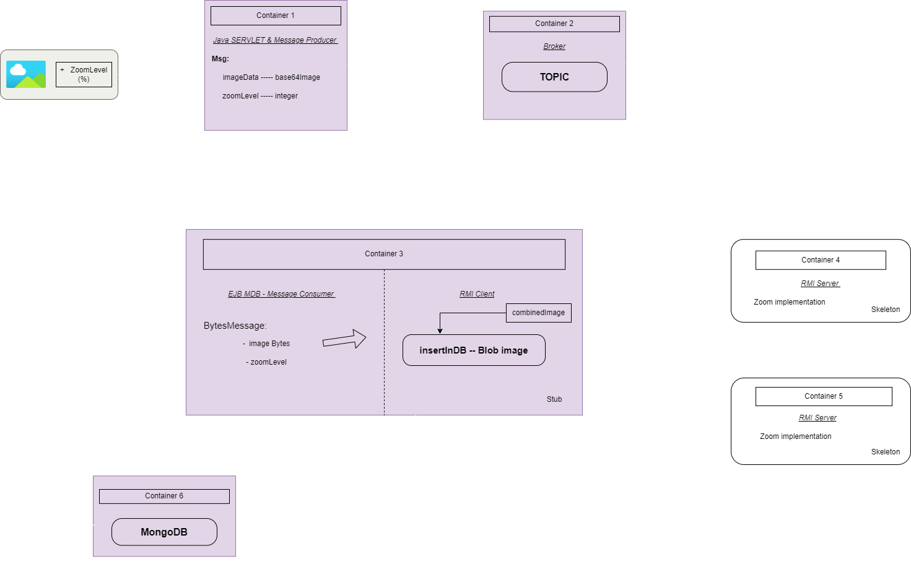

# Image Resizing using a Dockerized Distributed System

## Overview

This project is a scalable **image processing solution** implemented as a **Dockerized distributed system**. It efficiently resizes BMP images using **Java-based microservices**. The system leverages **Java RMI**, **JMS**, **EJB**, and **RESTful APIs** to create a scalable image processing pipeline. It processes images by accepting uploads via a web-based frontend, queues them for processing through **JMS messaging**, distributes resizing tasks to **RMI servers**, and finally stores the processed results in a **MySQL database** while system metrics are collected in **MongoDB**.

The development environment is based on **Docker** with Java microservices running inside dedicated containers. The backend utilizes **Jakarta EE Servlet REST API** for request handling and **Apache TomEE 9** for hosting the microservices. The core runtime components include:
- **Java JDK 21** for executing Java applications.
- **Apache TomEE Plume 9.1.2** for managing servlets, JMS messaging, and EJB modules.
- **Docker Image**: `critoma/linux-u20-dev-security-ism` from Docker Hub, ensuring consistency across deployments.

The system architecture is illustrated below:



## Architecture
The system consists of six Docker containers:
1. **Frontend (C01)** - Accepts image uploads and parameters via a REST API.
2. **JMS Broker (C02)** - Apache TomEE 9 acting as a JMS Topic Broker.
3. **Processing Unit (C03)** - Subscribes to JMS messages and acts as an RMI client for image resizing.
4. **RMI Server 1 (C04)** - Handles resizing operations.
5. **RMI Server 2 (C05)** - Secondary resizing server.
6. **Database (C06)** - MySQL for images and MongoDB for SNMP monitoring.

### Workflow
1. **Image Upload** - Users upload BMP images via a REST API implemented with a **Jakarta EE Servlet** (`UploadImageS.java`). The frontend provides an HTML form (`uploadImage.html`) that allows users to select and upload BMP images. The servlet processes the image, encodes it in Base64, and publishes it as a binary message to the **JMS Topic** for further processing.
2. **JMS Messaging** - The image is sent as a binary message to the JMS broker.
3. **Processing & RMI** - The processing unit retrieves the image and distributes resizing tasks to RMI servers.
4. **Database Storage** - The resized image is stored in MySQL, and system metrics are recorded in MongoDB.
5. **Notification & Download** - The frontend is notified when processing is complete, and users can download the final image.

## Deployment

### Saving Projects to Docker Containers
Before running the containers, we need to copy the compiled project files into their respective Docker containers. The following commands are used to transfer the necessary `.war` and `.jar` files into each container:

```bash
# Copy WAR files to appropriate containers
docker cp c02.war c02:/home/stud
docker cp c01.war c01:/home/stud
docker cp c03.war c03:/home/stud

# Copy JAR files for RMI Servers
docker cp c04.jar c04:/home/stud/eu/deic/
docker cp c05.jar c05:/home/stud/eu/deic/
```

Once the files are copied, they can be deployed inside their respective containers.

### Running the Containers
Below are the key Docker commands used to deploy each container:

#### **Container 1 - Frontend & REST API**
```bash
docker run --name c01 -p 8080:8080 -it critoma/linux-u20-dev-security-ism
su - stud
export JAVA_HOME=/opt/software/jdk-21
export PATH=.:$JAVA_HOME/bin:$PATH
wget https://dlcdn.apache.org/tomee/tomee-9.1.2/apache-tomee-9.1.2-plume.tar.gz
tar -xf apache-tomee-9.1.2-plume.tar.gz
mv apache-tomee-plume-9.1.2 /opt/software/
export CATALINA_HOME=/opt/software/apache-tomee-plume-9.1.2
cp /home/stud/c01.war $CATALINA_HOME/webapps/
$CATALINA_HOME/bin/startup.sh
```

#### **Container 2 - JMS Broker**
```bash
docker run --name c02 -it critoma/linux-u20-dev-security-ism
su - stud
export JAVA_HOME=/opt/software/jdk-21
export PATH=.:$JAVA_HOME/bin:$PATH
cp /home/stud/c02.war $CATALINA_HOME/webapps/
$CATALINA_HOME/bin/startup.sh
```

#### **Container 3 - Processing Unit**
```bash
docker run --name c03 -it critoma/linux-u20-dev-security-ism
su - stud
export JAVA_HOME=/opt/software/jdk-21
export PATH=.:$JAVA_HOME/bin:$PATH
mkdir -p eu/deic
cd eu/deic
java -jar c03.jar
```

#### **Containers 4 & 5 - RMI Servers**
```bash
docker run --name c04 -it critoma/linux-u20-dev-security-ism
su - stud
export JAVA_HOME=/opt/software/jdk-21
export PATH=.:$JAVA_HOME/bin:$PATH
mkdir -p eu/deic
cd eu/deic
java -jar c04.jar -Djava.security.policy=policy.all
```

```bash
docker run --name c05 -it critoma/linux-u20-dev-security-ism
su - stud
export JAVA_HOME=/opt/software/jdk-21
export PATH=.:$JAVA_HOME/bin:$PATH
mkdir -p eu/deic
cd eu/deic
java -jar c05.jar -Djava.security.policy=policy.all
```

#### **Container 6 - Database (MySQL & MongoDB)**
```bash
docker run --name c06 -p 3000:3000 -p 3030:3030 -it critoma/linux-u20-dev-security-ism
su - stud
sudo service mysql start
mysql -u root -pstud
CREATE DATABASE resizedImage;
CREATE USER mysqluser IDENTIFIED BY 'mysqluserpwd';
GRANT ALL PRIVILEGES ON resizedImage.* TO 'mysqluser';
CREATE TABLE Imgs (id INT AUTO_INCREMENT, photo BLOB NOT NULL, PRIMARY KEY(id));
```

## Running the Application
1. Start all containers in the correct order (C01 → C02 → C03 → C04 & C05 → C06).
2. Access the frontend via `http://localhost:8080/ImageResizingWebApp/index.html`.
3. Upload a BMP image and set zoom parameters.
4. The processed image will be available for download once complete.